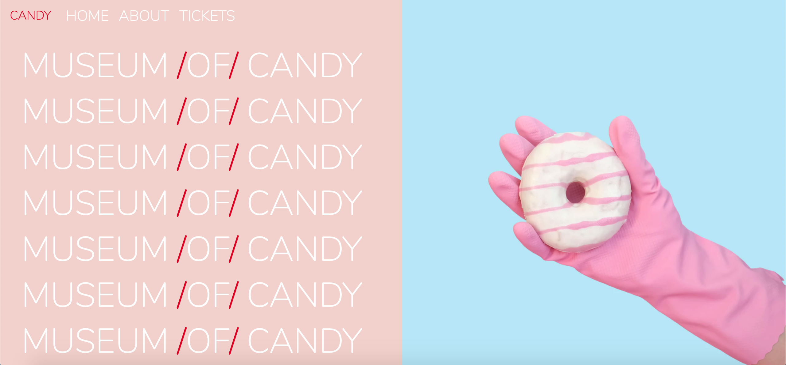

# Museum of Candy

## Description 
Website utilizing bootstrap components and mobile responsive layout

## Table of contents
* [Installation](#installation)
* [Usage](#usage)
* [Demo](#demo)
* [Questions](#questions)

## Installation
Museum of Candy was created to run in the browser with a **mobile responsive design** and therefore **no installation is needed**

**Museum of Candy can be found at: https://sylhuynh.github.io/museum-of-candy/**

## Usage
When users first visit the site, they will be taken to the homepage 

## Demo
Demonstration of mobile responsive layout and images

## Questions

If you have any questions about the repo or would like to report a bug, open an issue or contact the team directly at:
| Contributors       | Email        
| ------------- |:-------------:|
   | sylhuynh76@gmail.com |